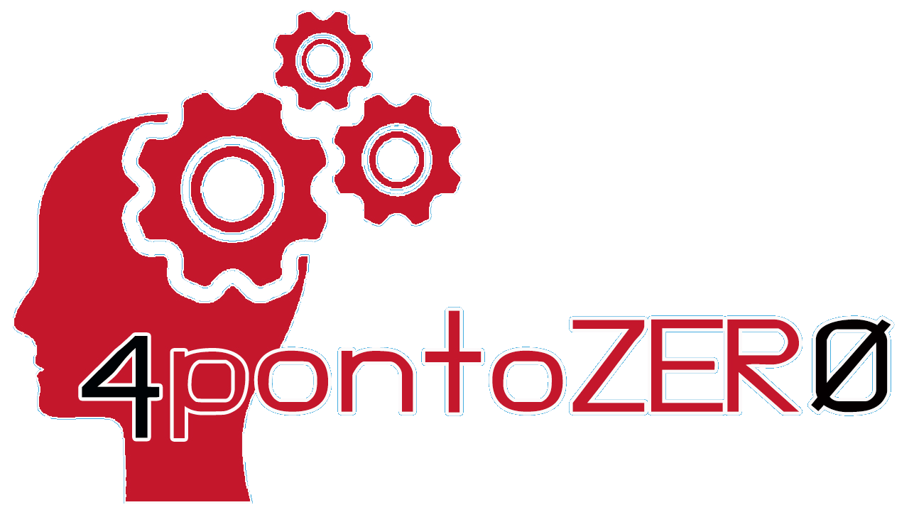

# Problema

Os Jovens estão inserido em um grupo de grande vulnerabilidade
social e econômica, que apresentam grandes índices de evasão
escolar e desemprego, precisam de oportunidades. No entanto,
isso só é possível com uma educação transformadora e inovadora.
Uma realidade destacada em vários estudos e análises feitas em
muitos países é de que não há uma única juventude, mas sim,
diversas juventudes que estão diretamente ligadas à realidade em
que nascem e vivem.
Ao nos aprofundarmos nos desafios dessas juventudes, é possível
observar que cerca de 71 milhões estão desempregados e, ainda
mais grave, 156 milhões vivem na zona da pobreza – ou seja, mesmo uma grande parte
desse público possua emprego, não recebem o suficiente para se
manter.

E a problemática não vem de agora: em 2015, apenas 38% dos jovens
matriculados no Ensino Médio estavam na série correta; sendo que, no
mesmo ano, tínhamos apenas 43% dos jovens no Brasil com Ensino Médio
completo.

Mediante a isso os seguinte questionamento foram propostos: Como
vencer desafios como a evasão escolar, a falta de perspectiva crescimento e o desalento quanto a busca do primeiro emprego? E **“Iniciativa 4pontoZERO”** é uma proposta de solução viável que pode
atender as demandas desses questionamentos.

Entre as várias soluções possíveis a EDUCAÇÃO é o caminho mais seguro e
transformador. O ano de 2020 mostrou o quanto os educadores precisam se
apropriar do uso das ferramentas tecnológicas para ensinar. Estamos em
uma época em que a tecnologia está dominando todos os espaços e
interferindo em nossas ações. Estamos na era da Indústria 4.0 e Tecnologias
4.0 (inteligência artificial, robótica, internet das coisas, impressora 3D,
realidade virtual e aumentada, internet 5G) que estão transformando toda
a sociedade de forma muito acelerada. A tecnologia está determinando os
rumos da humanidade, estamos em um mundo dinâmico em constantes
mudanças e a escola não está acompanhando essas mudanças.

# Justificativa

Atualmente vivenciamos uma nova revolução, e nesta temos algo
de muito diferente das revoluções anteriores. Não são os seres
humanos que estão ditando a velocidade com a qual as coisas
estão mudando, mas sim a tecnologia. Estamos inseridos em um
mundo tecnológico, mas não fomos incluídos neste mundo.

Estamos no século 21, porém a educação em nosso país está no
século 19. Na era da Indústria 4.0 precisamos de uma Educação 4.0.
Estamos vivendo uma era em que todo educador precisa sair de
sua zona de conforto e “#PensarForadaCaixa”. É preciso Inovar e
Empreender na Educação para  impactar e transforma positivamente a vida dos estudantes. Por isso é de fundamental importância a capacitação a qualificação do maior número de
educadores que for possível, e dessa forma as secretarias de
educação, assim como o iniciativa privada, têm um papel
fundamental na formação dos professores da educação básica.

Educação 4.0, é uma resposta às necessidades da “Indústria 4.0”,
também conhecida como “Quarta Revolução Industrial”, se somam
para dinamizar os processos nos mais variados segmentos da
indústria. Estamos falando de alunos da “Geração Alfa”, os
chamados “nativos digitais”; neste sentido é essencial desenvolver
estudantes com habilidades autônomas, para assim se tornarem
capazes de acompanhar as rápidas inovações, sabendo filtrar as
informações que lhe chegam e para que não fiquem desatualizados
no mercado de trabalho. Na Educação 4.0 os professores são um
dos principais pilares para que a nova abordagem comece a ser
aplicada. Dessa forma, eles precisam estar preparados, para
dominar muito bem os conceitos da educação tecnológica e digital
e; precisam possuir facilidades para o aceso e a utilização de
recursos tecnológicos.

# Objetivos

## Objetivo Geral

Capacitar e qualificar professores para atuarem com uma proposta
de Educação 4.0, afim de que possam trabalhar com Ferramentas
Tecnológica e Metodologias Ativas da Educação do Século 21,
dentro do processo de ensino‐aprendizagem das escolas, em
comunidade e nas suas áreas de atuação. Com a finalidade de
poder criar uma nova mentalidade de protagonismo, criatividade,
inovação e empreendedorismo entre os estudantes.

## Objetivos Específicos

1. Realizar oficinas sobre a indústria 4.0 e a importância da
educação 4.0 para o século 21
2. Qualificar os Educadores (Professores, Gestores, coordenadores escolares e entusiastas da educação) para o uso das Metodologias Ativas da Educação do Século 21 ea Educação 4.0;
3. Capacitar os Educadores par o uso dos Recursos da “Iniciativa
4pontoZERO”.

# Metas

1. Fazer a formação do maior número possível dos professores de toda
rede de ensino que adotar a “Iniciativa 4pontoZERO”;
2. Diminuir a evasão escolar;
3. Conseguir maior engajamento de Professores e alunos nas atividades
dos projetos pedagógicos das escolas com foco na solução de
problema reais de forma criativa, inovadora e empreendedora, para
atender demandas do mercado de trabalho do século 21.
4. Incentivar o protagonismo de professores para que se tornem futuros
multiplicadores da “Iniciativa 4pontoZERO”.
5. Melhorar os números dos indicadores que medem a qualidade da
educação como IDEB, Prova Brasil, PISA, ENEM, etc.

# Proposta de Produto

A “Iniciativa 4pontoZERO”, pretende atingir suas metas e
objetivos por meio de uma **Plataforma Educacional**,
seguindo o modelo de plataformas já consolidadas como:
“Moodle” e “Google for Educacion”. Dessa forma
minimizando custo de produção, e operação e garantido
facilidade de acesso ao maior número de educadores
possível. Na qual, através desta plataforma o professor terá
acesso as aulas e os materiais necessários para sua formação,
para que seja capaz de fazer a inclusão de crianças,
adolescentes, jovens e adultos no mundo tecnológico e
digital da sociedade oferecendo uma Educação Científica,
Tecnológica e Digital para formar o cidadão do século 21.
Junto com a plataforma existe um **kit da aplicação das
metodologias da educação 4.0**, em que esse kit contém
planos de aulas e ensino, e‐books, notas de aulas, sugestões
de atividades práticas, software e aplicativos para o
desenvolvimento de aulas de robótica e programação, kits de
robótica e automação com Arduino, notebooks básicos para
ensino, multímetros e outras coisinhas a mais.

# Metodologia

Seguindo uma tendência mundial e fundamentada na nova Base Nacional Comum
Curricular (BNCC) e Nos Objetivos do Desenvolvimento Sustentável (ODS) da ONU
para a Educação a formação dos educadores será feita por meio de atividades
práticas, palestras e oficinas alicerçada nas Metodologias Ativas da Educação do
Século 21, especificamente a Educação Maker e o aprendizado STEAM que
priorizam o processo de ensino‐aprendizado a partir de atividades práticas para
solucionar problemas reais com foco em Ciência, Tecnologia, Engenharia, Arte e
Matemática. Dessa forma estimulando a Aprendizagem Ativa e Criativa, assim
como o espírito de inovação e empreendedorismo nos educadores.
Dessa forma, as ações do projeto estão alicerçadas no sociointeracionismo de
Vygotsky e o construcionismo de Seymour Papert. Na perspectiva da teoria
sociocultural de Vygotsky, os professores‐formadores serão os mediadores de
todo o processo de ensino‐aprendizagem, nunca dando respostas prontas e
acabadas, mas propondo desafios e orientando os educadores em formação, para
que achem as respostas necessárias para solucionar os desafios propostos. Do
construcionismo, de Papert, emprestar‐se‐á a ideia de que a aprendizagem se dá
por descoberta, permitindo ao estudante, de forma ativa, refletir sobre os erros e
buscar novos mecanismos para resolver problemas por meio de uma linguagem
próxima à linguagem natural.

# Recursos

O Projeto “Iniciativa 4pontoZERO” será um projeto de baixo
custo e para isso para uso de plataformas Open Source, com
o uso de softwares e hardwares livres, como a plataforma
Moodle ou Google for Education, Scratch, Arduino, etc. Além
de ser um projeto totalmente aberto, adaptativo,
sustentável e colaborativo. Desta forma o projeto pode ter o
**primeiro setor** – o poder público – como financiador e
parceiro, pois é do interesse do Estado reduzir a evasão
escolar, capacitar professores, garantir a melhoria dos
índices educacionais, capacitar os jovens para o mercado de
trabalho; outro parceiro e financiador pode ser o **segundo
setor** – a iniciativa privada –, visto que o mercado de
trabalho exige cada vez mais pessoas com espirito de
inovação, criatividade e empreendedorismo para atuarem
nas mais diversas áreas, assim financiando o projeto essas
empresas estariam investindo em qualificação de potenciais
futuros funcionários. E por fim, existe **pessoas como eu e
você que podem fazer doações** para manter o projeto a
 exemplo de outras plataformas que sobrevivem dessa forma.
